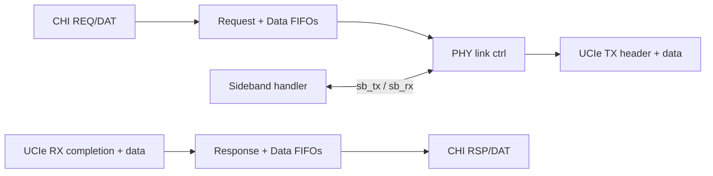

# CHI to UCIe Bridge

Experimental Verilog/SystemVerilog RTL for a bridge between an AMBA CHI request
node interface and a UCIe adapter-facing link model.

> Status: Phase 6 complete. Synthesizable bridge at 99.2% line coverage (16
> cocotb tests, 5 formal targets), 128-bit UCIe adapter header, multi-beat
> data, negotiated credit flow, QoS routing, PHY link-state FSM, sideband
> protocol handler, and split read-completion support. The protocol model is
> compact and intended for bring-up, not a bit-exact CHI or UCIe specification
> implementation.

## Project Overview

The bridge accepts CHI requests on `clk`, translates them into UCIe adapter
headers and optional data packets on `ucie_clk`, and returns UCIe completions
as CHI `Comp` / `CompData` responses. All clock-domain crossings use async FIFOs
or 2-flop synchronizers. A 4-state PHY link controller manages link bring-up,
error recovery, and retraining; a sideband handler handles parameter negotiation
and power-management L1 flows.



## Module Map

| Module | Role |
|:---|:---|
| `src/chi_to_ucie_bridge.v` | Top-level translation, CDC, link gating, credit flow, and QoS. |
| `src/chi_ucie_bridge_defs.vh` | CHI/UCIe field maps, opcodes, CRC16, and pack helpers. |
| `src/phy_link_ctrl.v` | 4-state PHY/link FSM: WAIT_PHY → ACTIVE → ERR_DRAIN → RETRAIN. |
| `src/sb_msg_handler.v` | Sideband TX/RX: link-state messages, PARAM negotiation, PM L1 flow. |
| `src/txn_table.v` | Outstanding-transaction table: local-tag allocation and CHI-identity restore. |
| `src/async_fifo.v` | Dual-clock first-word-fall-through Gray-code FIFO. |
| `src/credit_counter.v` | Parameterized 0..N credit counter used for TX header and data flow control. |
| `src/credit_pulse_sync.v` | Single-bit CDC pulse stretcher for credit returns across clock domains. |
| `src/cdc_sync.v` | Multi-flop single-bit synchronizer. |
| `src/reset_sync.v` | Async-assert / sync-deassert reset synchronizer. |
| `src/reset_drain.v` | Bridge-open FSM: gates traffic until `link_up` and FIFOs are empty. |
| `src/chi_to_ucie_bridge_sva.sv` | SVA bind module: concurrent assertions + cover points (Verilator/formal). |
| `src/chi_to_ucie_bridge_chk.v` | Formal reachability checker (runtime-disabled assertions). |
| `src/tb_chi_to_ucie_bridge.v` | Self-checking directed smoke test (Icarus). |

## Quick Start

```bash
make regress          # Verilator lint + Icarus directed simulation
make ci               # regress + formal + synthesis (full gate)

make sim              # directed testbench only (Icarus)
make vcd              # directed testbench with waveform
make vlt-vcd          # Verilator trace harness waveform

make coverage         # Verilator coverage + SVA run -> sim/coverage.info
cd verification/cocotb && make SIM=verilator   # 16 cocotb tests + coverage
make coverage-all     # merge directed + cocotb -> sim/coverage_merged.info

make formal           # 5 SymbiYosys targets (requires sby + yosys-smtbmc)
make synth            # Yosys synthesis smoke (requires yosys)
make clean
```

See [doc/tutorial.md](doc/tutorial.md) for a step-by-step walkthrough.

### What the directed smoke covers

- CHI read request → UCIe `AD_REQ / MEM_RD`; full 48-bit address preserved
- CHI write request + 512-bit data → UCIe `AD_REQ / MEM_WR` + multi-beat data
- Sub-cacheline write (size=5, 32 bytes, byte-enables forwarded) → 2 data beats
- Split read completion (two 32-byte MEM_CPL → CHI `CompData` with DataID=0/2)
- UCIe `AD_CPL / SC` → CHI `Comp`; QoS field round-tripped through `attr[3:0]`
- Sequential flit numbers checked across request and burst headers

### cocotb test suite (16 tests, Icarus and Verilator)

| Test | What it exercises |
|:---|:---|
| `test_read_translates` | Connectivity smoke: one read round-trip |
| `test_random_traffic` | 80 randomized reads/writes, backpressure, out-of-order completions |
| `test_random_errors` | Corrupted MEM_CPL checksums → CHI `RespErr=DERR` |
| `test_phy_error` | `link_error` injection → ERR_DRAIN → RETRAIN → ACTIVE |
| `test_sideband_pm_l1` | PM L1 REQ/ACK/EXIT sideband flow |
| `test_sideband_param` | PARAM_REQ/ACK sideband exchange |
| `test_split_completion` | Two 32-byte MEM_CPL halves reassembled |
| `test_txn_table_full` | All slots occupied → `txn_table_full` backpressure |
| `test_small_completions` | Sub-cacheline write + read round-trips |
| `test_tag_error` | Completion with unknown tag → `tag_err_cnt` |
| `test_rx_hdr_bad_crc` | Bad RX CRC → `crc_err_cnt` |
| `test_poison_completion` | Poison bit forwarded to CHI DAT |
| `test_rdat_fifo_full` | RX-data FIFO full → UCIe data backpressure |
| `test_err_inj` | `err_inj_en` pulse → `crc_err_cnt` increment |
| `test_wdat_fifo_full` | TX-data FIFO full → `chi_req_ready` backpressure |
| `test_rsp_fifo_full` | RSP FIFO full → `ucie_rx_hdr_ready` backpressure |

## Interface Model

### CHI side (`clk` domain)

| Signal group | Direction | Notes |
|:---|:---|:---|
| `chi_req_data[CHI_REQ_W-1:0]` / `chi_req_valid` / `chi_req_ready` | Input | Packed REQ flit |
| `chi_wr_data[CHI_DAT_W-1:0]` / `chi_wr_data_valid` / `chi_wr_data_ready` | Input | Write DAT flit |
| `chi_rsp_data[CHI_RSP_W-1:0]` / `chi_rsp_valid` / `chi_rsp_ready` | Output | Comp RSP flit |
| `chi_comp_data[CHI_DAT_W-1:0]` / `chi_comp_data_valid` / `chi_comp_data_ready` | Output | CompData DAT flit |

### UCIe side (`ucie_clk` domain)

| Signal group | Direction | Notes |
|:---|:---|:---|
| `ucie_tx_hdr[127:0]` / `_valid` / `_ready` | Output | 128-bit TX adapter header |
| `ucie_tx_data[127:0]` / `_valid` / `_ready` | Output | Multi-beat TX data (5 beats: beat 0 = 128-bit header, beats 1–4 = 128-bit data) |
| `ucie_rx_hdr[127:0]` / `_valid` / `_ready` | Input | 128-bit RX completion header |
| `ucie_rx_data[127:0]` / `_valid` / `_ready` | Input | Multi-beat RX data |
| `ucie_rx_hdr_crdt` / `ucie_rx_dat_crdt` | Input | Far-end credits returned |
| `ucie_tx_hdr_crdt` / `ucie_tx_dat_crdt` | Output | Bridge grants RX completion slots |

### 128-bit adapter header layout

| Field | Bits | Width | Description |
|:---|:---|:---|:---|
| `kind` | [127:124] | 4b | Packet type (AD_REQ, AD_CPL, MEM_CPL) |
| `code` | [123:120] | 4b | Opcode / status (MEM_RD, MEM_WR, SC, WR_DATA, RD_DATA) |
| `tag` | [119:112] | 8b | Bridge-local tag (not CHI TxnID) |
| `attr` | [111:104] | 8b | MemAttr / Order; `attr[3:0]` carries QoS |
| `length` | [103:96] | 8b | Transfer size in bytes (1 << chi_size) |
| `src_id` | [95:88] | 8b | Requester node ID |
| `flit_seq` | [87:80] | 8b | TX flit sequence counter (wraps mod 256) |
| `addr` | [79:32] | 48b | Full 48-bit address |
| `reserved` | [31:16] | 16b | — |
| `crc16` | [15:0] | 16b | XOR of seven 16-bit slices [127:16] |

Data bursts use 5 beats on `ucie_tx_data` / `ucie_rx_data`: beat 0 is a 128-bit
header (`kind=AD_REQ` for writes, `kind=MEM_CPL` for read completions), beats 1–N
are 128-bit data payload. N is derived from the transfer size (size=4 → 1 beat,
size=5 → 2 beats, size=6 → 4 beats). The poison bit is carried in `attr[7]` of
the beat-0 header.

## Design Limits

| Area | Status |
|:---|:---|
| Protocol compliance | Compact field model; not bit-exact CHI or UCIe flit framing. |
| CHI channels | REQ, RSP, DAT modeled; SNP and full coherency out of scope. |
| Ordering | FIFO in-order per stream; no full per-class reorder buffer. |
| Credits | Negotiated runtime credit counters implemented; no UCIe credit-flow version negotiation. |
| Data path | 512-bit max (4 × 128-bit beats); wider transfers not supported. |
| QoS | `attr[3:0]` carries QoS end-to-end; no weighted-arbitration or per-class queuing. |
| Formal depth | BMC depth 8–16; unbounded proof of async-FIFO not attempted. |

## Future Upgrades and Plans
- Planning in work as of 2 Sept. 2026

See [doc/design-spec.md](doc/design-spec.md) for the full design description and
[doc/PLAN.md](doc/PLAN.md) for phase history.
