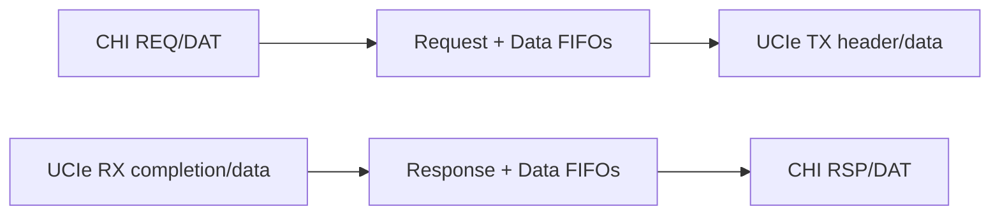

# CHI to UCIe Bridge

Experimental Verilog/SystemVerilog RTL for a bridge between an AMBA CHI request
node interface and a UCIe adapter-facing link model.

> Status: Phase 1 RTL scaffold. The repo has a synthesizable bridge, dual-clock
> CDC FIFOs, reset/link-drain gating, checksum-protected UCIe headers, and a
> self-checking directed testbench. The protocol model is compact and intended
> for bring-up, not a bit-exact CHI or UCIe specification implementation.

## Project Overview

The bridge accepts CHI requests on `clk`, translates them into UCIe adapter
headers and optional data packets on `ucie_clk`, and returns UCIe completions as
CHI `Comp` / `CompData` responses. All clock-domain crossings use async FIFOs or
2-flop synchronizers.



## Module Map

| Module | Role |
|:---|:---|
| `src/chi_to_ucie_bridge.v` | Top-level translation, CDC, link gating, and counters. |
| `src/chi_ucie_bridge_defs.vh` | CHI/UCIe field maps, opcodes, checksum, and pack helpers. |
| `src/async_fifo.v` | Dual-clock first-word-fall-through FIFO. |
| `src/cdc_sync.v` | Multi-flop single-bit synchronizer. |
| `src/reset_sync.v` | Async-assert / sync-deassert reset synchronizer. |
| `src/reset_drain.v` | Link-up/down bridge-open FSM. |
| `src/tb_chi_to_ucie_bridge.v` | Self-checking directed smoke test. |

## Quick Start

```bash
make regress   # Verilator lint + Icarus directed simulation
make sim       # directed testbench only
make vcd       # directed testbench with waveform
make vlt-vcd   # Verilator trace harness waveform
make coverage  # Verilator coverage run -> sim/coverage.info
make synth     # Yosys synthesis smoke if yosys is installed
make formal    # SymbiYosys smoke targets if sby is installed
make clean
```

The directed smoke covers:

- CHI read request translated to UCIe `AD_REQ / MEM_RD`
- CHI write request and 512-bit data translated to UCIe header + data packet
- UCIe successful adapter completion translated to CHI `Comp`
- UCIe memory data completion translated to CHI `CompData`

## Interface Model

The CHI side uses structured packed flits with REQ, RSP, and DAT field slices.
The UCIe side uses:

- `ucie_tx_hdr` / `ucie_rx_hdr`: 64-bit adapter headers
- `ucie_tx_data` / `ucie_rx_data`: `{header, poison, 512-bit payload}`

UCIe headers include a simple byte-XOR checksum in bits `[7:0]`; bad receive
checksums are converted into CHI error responses/data and counted in
`crc_err_cnt`.

## Known Limits

| Area | Current Limit |
|:---|:---|
| Protocol compliance | Compact field model only; not bit-exact CHI or UCIe flit framing. |
| CHI channels | REQ, RSP, and DAT are modeled; SNP and full coherency state are out of scope. |
| Ordering | FIFO ordering is preserved; no full CHI transaction scoreboard or DBID allocator yet. |
| Credits | Phase 1 credit parameters gate class enablement but do not implement negotiated UCIe credit return. |
| Payloads | Single 512-bit data beat only. |

See [doc/design-spec.md](doc/design-spec.md) and [doc/PLAN.md](doc/PLAN.md) for
the current design notes and roadmap.
